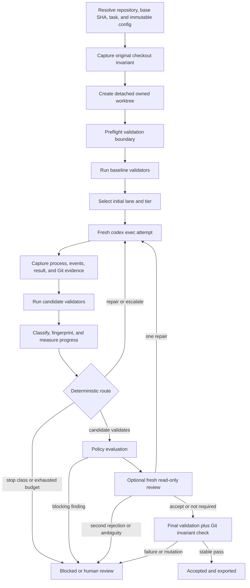

# codex-auto

Deterministic, validation-driven orchestration for Codex coding runs.

`codex-auto` is a local Python CLI that puts a strict external controller around `codex exec`. Models write and diagnose code; typed controller logic owns routing, retry budgets, validation, review, acceptance, recovery, and artifact export.

It is designed for engineers who want autonomous coding attempts without delegating control of the retry loop—or the definition of “done”—to the model being evaluated.

> Project status: version `0.1.0`, alpha. The core workflow is implemented and tested; cross-platform CI is configured, but operational adoption should begin with low-risk repositories and explicit validators.

## At a glance

| Property | Behavior |
|---|---|
| Runtime | Python 3.11+, standard library only |
| Model execution | Fresh, non-interactive `codex exec` process per attempt |
| Routing | Pure deterministic Python; no LLM router |
| Isolation | One detached Git worktree per run, outside the target repository |
| Acceptance | External validation plus policy, optional review, and final invariant checks |
| Persistence | SQLite journal plus checksummed filesystem artifacts |
| Recovery | Conservative reconciliation; interrupted model work is captured, never blindly replayed |
| Process control | Windows Job Objects; POSIX process groups and controller-death watchdog |
| Network | Disabled by default for validation; never enabled by model output |
| Git publishing | No automatic commit, merge, rebase, push, or pull request |
| Test model | Scenario-driven fake Codex; normal tests make no real model request |

## Why this exists

A prompt such as “try twice, then use a stronger model” is not an enforcement mechanism. One model process can loop internally, reinterpret retry limits, weaken tests, accept its own prose as proof, or keep making equivalent changes without measurable progress.

`codex-auto` moves those decisions outside the model process:

- a state machine defines the legal lifecycle;
- a routing engine chooses the next model and effort from immutable evidence;
- process supervision bounds startup, inactivity, total runtime, output, and descendants;
- Git snapshots reveal what actually changed, including staged and untracked files;
- validators run independently of model self-report;
- failure fingerprints detect equivalent failures;
- policy rejects scope violations, candidate commits, test weakening, unsafe paths, and excessive changes;
- an optional fresh read-only reviewer evaluates a candidate only after validation;
- final validation must pass without mutating the worktree;
- SQLite and filesystem evidence make crash recovery explicit and auditable.

The central invariant is:

> Models implement and diagnose. Deterministic controller code selects models, counts attempts, classifies outcomes, runs validation, and decides acceptance.

## How a run works



Every model attempt is a fresh top-level process. Attempts in one run share the same worktree so a stronger tier can inspect and repair the current candidate, while authoritative controller state remains outside that worktree.

## Routing model

### Lanes

| Lane | Initial tier | Intended use | Default substantive path |
|---|---|---|---|
| `mechanical` | Luna Medium | Explicit, repetitive, low-risk work with a decisive validator | Luna High only with localized progress; otherwise Sol High |
| `standard` | Luna High | Normal coding with objective validation | At most one evidence-based repair, then Sol High |
| `bounded-hard` | Luna XHigh | Explicitly selected hard but tightly specified work | Sol High |
| `latency` | Terra Medium | Explicit latency-sensitive work | At most one evidence-based repair, then Sol High |
| `high-risk` | Sol High | Security, state, destructive, migration, concurrency, or broad architecture work | One evidence-based repair, then one deep route |
| `auto` | Determined by policy | CLI/task/repository rule precedence | Resolves to one of the lanes above |

Lane precedence is:

1. explicit CLI lane;
2. task-spec lane;
3. repository routing rule;
4. high-risk match;
5. positive mechanical match;
6. standard.

A failed Luna route never falls back to Terra. Terra is an explicit latency lane, not a cheaper universal retry.

### Repair, rescue, and deep routing

- Transient infrastructure errors use a separate same-tier retry budget.
- A substantive same-tier repair requires new external evidence, measurable progress, a nonrepeated fingerprint, and remaining repair budget.
- Luna or Terra failures rescue to Sol High when policy says the current family is exhausted.
- Sol High can select exactly one deep route:
  - Sol Max for serial, tightly coupled work;
  - Sol Ultra for explicitly declared parallel workstreams.
- Model self-report cannot select Ultra or any other route.
- Exhausted deep work stops for human review; it does not cycle model combinations.

Logical efforts are `low`, `medium`, `high`, `xhigh`, `max`, and `ultra`. If the installed CLI rejects Max or Ultra, `codex-auto` may use configured same-model effort fallbacks only after proving the rejected invocation did not modify the candidate. Requested and effective efforts are both reported.

### Stop classes

These conditions stop instead of escalating to a more expensive model:

- missing or invalid credentials;
- permission failures;
- unavailable or invalid sandbox configuration;
- controller/environment failures;
- unsupported configuration with no allowed fallback;
- contradictory or malformed task specification;
- deterministic policy violations;
- cancellation;
- exhausted bounded retry/deep budgets.

Stronger reasoning does not repair missing access, a broken runtime, or contradictory requirements.

## Quick start

### Requirements

- Python 3.11 or newer;
- Git;
- a locally installed Codex CLI for real runs;
- a Git repository with at least one commit;
- validators that objectively determine whether the requested change is acceptable.

No third-party package is required at runtime.

### Install from a clone

PowerShell:

```powershell
git clone https://github.com/git-geeky/codex-auto.git
Set-Location codex-auto
python -m venv .venv
.venv\Scripts\python.exe -m pip install -e ".[dev]"
.venv\Scripts\codex-auto.exe --help
```

POSIX shell:

```bash
git clone https://github.com/git-geeky/codex-auto.git
cd codex-auto
python3 -m venv .venv
.venv/bin/python -m pip install -e '.[dev]'
.venv/bin/codex-auto --help
```

To install a built artifact:

```bash
python -m pip install dist/codex_auto-0.1.0-py3-none-any.whl
```

### Initialize a target repository

From the target Git repository:

```powershell
codex-auto init
codex-auto config check
codex-auto doctor --json
```

`init` creates:

```text
.codex-auto/
├── README.md
└── router.toml
.gitignore
TASK.md
```

It does not create runtime state inside the repository and refuses to overwrite existing files unless `--force` is explicit.

Review `.codex-auto/router.toml` before the first run. The generated validation steps are a starting point, not a universal test configuration.

### First dry run

```powershell
codex-auto dry-run `
  --task-file TASK.md `
  --acceptance "All configured validators pass" `
  --json
```

```bash
codex-auto dry-run \
  --task-file TASK.md \
  --acceptance 'All configured validators pass' \
  --json
```

Dry run resolves the base SHA, lane, matched rules, expected model sequence, effort fallbacks, worktree location, validators, reviewer policy, and redacted command shapes. It does not invoke Codex or create run state.

### Fake-Codex escalation demonstration

The default test suite uses a local fake executable and consumes no Codex quota:

```powershell
python -m pytest tests/integration/test_orchestrator.py::test_repeated_luna_fingerprint_escalates_to_sol_and_passes -q
```

That scenario proves a Luna High attempt, one evidence-based Luna repair, repeated-fingerprint escalation to Sol High, external validation, SQLite evidence, Git isolation, report generation, and patch export.

### First real run

After reviewing the resolved configuration and validator boundary:

```powershell
codex-auto run `
  --task-file TASK.md `
  --acceptance-file ACCEPTANCE.md
```

```bash
codex-auto run \
  --task-file TASK.md \
  --acceptance-file ACCEPTANCE.md
```

Repository-controlled validation executes in `codex sandbox` by default. If—and only if—you intentionally trust the repository's validation commands on the host, add:

```text
--trust-repository-for-host-validation
```

Host execution is never a silent fallback.

## Configuration

Repository configuration lives at `.codex-auto/router.toml`. Precedence is:

1. built-in defaults;
2. optional user config under the external state root;
3. repository config;
4. task-spec overrides;
5. CLI flags.

Unknown keys fail with their exact TOML path unless compatibility mode explicitly permits them. The effective configuration and value origins are available through:

```powershell
codex-auto config show --json
```

Each run snapshots the normalized effective configuration and repository policy before candidate execution. A model cannot edit `.codex-auto/router.toml` mid-run to weaken its own acceptance policy.

### Minimal validator example

```toml
version = 1

[controller]
default_lane = "standard"
default_deep_mode = "serial"
max_transient_retries = 2
max_same_tier_repairs = 1

[validation]
execution = "codex-sandbox"
require_safe_execution = true
allow_host_only_with_explicit_trust = true

[[validation.steps]]
name = "unit-tests"
stage = "targeted"
command = ["python", "-m", "pytest", "-q", "tests/unit"]
working_directory = "."
timeout_seconds = 600
policy = "must_pass"
expected_exit_codes = [0]
platform = "all"
environment_allowlist = ["PATH", "HOME", "USERPROFILE", "SYSTEMROOT", "WINDIR"]
output_limit_bytes = 10485760
safe_to_rerun = true
network_required = false
sandbox_profile = ":workspace"
comparison_mode = "failure_ids"
```

Commands are always argument arrays. `shell=True` is not used.

### Validation stages and policies

Stages execute in this order:

1. `baseline` — establishes required starting behavior and known failures;
2. `smoke` — fast syntax/build/import checks;
3. `targeted` — focused tests for the requested change;
4. `full` — broader regression coverage.

Policies:

| Policy | Meaning |
|---|---|
| `must_pass` | The configured command must exit with an expected code |
| `no_regression` | Baseline failures may remain, but no new/worsened normalized failures are allowed |
| `advisory` | Evidence is recorded but does not independently accept or block |
| `manual` | Human disposition is required |

A failing no-regression oracle that produces no stable failure identifiers is rejected as too weak to prove equivalence.

Every validation step also declares its platform, working directory, environment allowlist, output cap, timeout, rerun safety, network requirement, and comparison mode.

### Task input

Supported forms:

```powershell
codex-auto run --task "Implement the requested change" --acceptance "All tests pass"
codex-auto run --task-file TASK.md --acceptance-file ACCEPTANCE.md
codex-auto run --spec TASK.json
```

JSON task specs can include task text, acceptance criteria, lane, deep mode, base ref, allowed/forbidden paths, high-risk declaration, independent workstreams, supported config overrides, metadata, and an external correlation ID. YAML is intentionally not required.

## CLI reference

| Command | Purpose |
|---|---|
| `codex-auto init [--force]` | Create maintained repository config and task templates |
| `codex-auto config check` | Strictly validate effective configuration |
| `codex-auto config show [--json]` | Show normalized config and origins |
| `codex-auto doctor [--refresh] [--json]` | Inspect Codex/Git/Python/platform/state/sandbox capabilities without a model request |
| `codex-auto dry-run ...` | Explain the route and validators without creating a run |
| `codex-auto run ...` | Start a supervised run |
| `codex-auto resume <run-id> [--dry-run]` | Reconcile and safely continue an interrupted run |
| `codex-auto cancel <run-id>` | Request cancellation of the owned process tree |
| `codex-auto status <run-id> [--json]` | Read durable run status |
| `codex-auto report <run-id> [--json]` | Render the human Markdown or machine JSON report |
| `codex-auto export <run-id> [--output DIR]` | Copy final checksummed artifacts |
| `codex-auto stats [--since 30d] [--repository PATH] [--json]` | Aggregate routing, usage, timing, review, and blocker telemetry |
| `codex-auto cleanup <run-id> [--discard-unexported]` | Remove only the registered retained worktree |

Useful run options include:

```text
--base-ref
--lane {auto,mechanical,standard,bounded-hard,latency,high-risk}
--deep-mode {serial,parallel}
--allowed-path / --forbidden-path
--no-review / --review-always
--attempt-timeout
--retain-raw-events
--trust-repository-for-host-validation
--json-events
--quiet / --verbose
```

### Stable exit codes

| Code | Meaning |
|---:|---|
| `0` | Successful inspection/configuration or accepted run |
| `2` | CLI, configuration, repository, persistence, or security-boundary error |
| `4` | Completed run/recovery that is blocked, cancelled, failed, or requires human review |

Human output and JSON output are separate. `run --json-events` emits a machine-readable terminal result object.

## Evidence and artifacts

Runtime state defaults to:

| Platform | Default state root |
|---|---|
| Windows | `%LOCALAPPDATA%\codex-auto` |
| Linux | `$XDG_STATE_HOME/codex-auto`, else `~/.local/state/codex-auto` |
| macOS | `~/Library/Application Support/codex-auto` |

Set `CODEX_AUTO_HOME` to override the root.

```text
<state-root>/
├── state.sqlite3
├── cache/
├── schemas/
├── worktrees/
│   └── <run-id>/
└── runs/
    └── <run-id>/
        ├── metadata.json
        ├── task.md
        ├── acceptance.md
        ├── input-hashes.json
        ├── effective-config.json
        ├── capabilities.json
        ├── repository-router.toml
        ├── route.json
        ├── transitions.jsonl
        ├── controller.log
        ├── git-snapshots/
        ├── validation/
        ├── attempts/
        │   └── 001-<model>-<effort>/
        ├── review/
        ├── report.json
        ├── report.md
        └── final/
            ├── final.patch
            ├── untracked-files.tar
            ├── changed-files.json
            ├── report.json
            ├── report.md
            └── checksums.json
```

### What is persisted

- immutable task, acceptance, hashes, config, capabilities, and base SHA;
- requested and effective model/effort sequence;
- every durable transition and journaled side effect;
- bounded process result and safe event summaries;
- before/after Git snapshots for attempts and final validation;
- validator results and normalized failures;
- failure classifications, fingerprints, and progress decisions;
- routing decisions and reviewer findings;
- policy findings and changed-file manifest;
- token usage by attempt, model, and effort;
- Codex, validation, review, and total wall-clock timing;
- exact worktree, patch, archive, report, and checksum paths.

Large logs and patches stay in files; SQLite stores queryable metadata, paths, sizes, and hashes.

### Export and cleanup

```powershell
codex-auto export <run-id> --output C:\path\to\export
codex-auto cleanup <run-id>
```

Cleanup:

- refuses active runs;
- verifies exact repository/run worktree ownership;
- refuses incomplete, modified, or unexported artifacts unless destructive discard is explicit;
- removes only the registered worktree;
- preserves reports, patches, archives, checksums, and SQLite history;
- never performs broad wildcard deletion.

## Recovery and cancellation

Run and repository locks include both PID and process-start identity, preventing PID reuse from impersonating the original controller. Force-taking a stale lock requires `--force-stale-lock` and creates an audited operation.

```powershell
codex-auto resume <run-id> --dry-run --json
codex-auto resume <run-id> --force-stale-lock --json
```

Recovery behavior:

1. inspect the last durable state and incomplete operations;
2. verify the registered repository, base SHA, worktree identity, and owner;
3. mark interrupted model execution as interrupted—never replay it blindly;
4. rerun candidate validation only if every configured step is marked safe;
5. export the captured candidate and apply Git/path/size/test policy;
6. run any review required by lane or changed paths;
7. rerun final validation and compare before/after Git snapshots;
8. accept only a stable validating candidate; otherwise block or require human review.

Interrupted non-idempotent validation, ambiguous side effects, unavailable required review, reviewer repair requests, and invalid candidates do not trigger speculative model work.

Cancellation is file-signaled and observed by baseline, model, candidate validation, review, and final validation. The process supervisor terminates the owned process tree, preserves bounded evidence, and records a terminal cancelled state.

## Security model

### Separate trust boundaries

`codex-auto` treats these as distinct boundaries:

1. **Model execution** — `codex exec`, fresh and ephemeral where supported, `workspace-write`, unattended approval denial, external schema/result paths.
2. **Review** — a fresh Codex execution in `read-only` mode.
3. **Validation** — `codex sandbox` with a named permission profile and network disabled by default, or explicitly trusted host execution.
4. **Controller state** — outside candidate worktrees and not writable by model processes.

Unrestricted flags such as `--full-auto`, `--yolo`, and sandbox/approval bypass are not used.

### Validation trust

Build and test commands are repository-controlled code. The default boundary is the installed Codex sandbox using the built-in `:workspace` permission profile. `doctor` and run preflight test that profile without a model request and fail closed if it is unusable.

Host validation requires `--trust-repository-for-host-validation`. A model cannot add that flag, change the validation execution mode, or enable network access.

### Redaction and retention

- subprocess environments are allowlisted, not logged wholesale;
- recognizable authentication material and configured sensitive values are redacted before durable prompts/reports/events/errors;
- reasoning text is not retained;
- full raw JSONL is disabled by default;
- `--retain-raw-events` stores only bounded, redacted output and should be used deliberately;
- task and acceptance files are authoritative verbatim recovery inputs, so credentials do not belong in them;
- artifact directories use restrictive permissions where the platform supports them.

### Deterministic policy gates

Before acceptance, policy checks:

- allowed and forbidden recursive path globs;
- traversal and symlink escapes;
- high-risk paths;
- protected-test weakening or deletion;
- changed-file, insertion, and deletion limits;
- candidate-created commits or branch changes;
- original checkout HEAD, branch, index, status, untracked manifest, and tracked hashes;
- final-validation mutation;
- export completeness and checksums.

## Process supervision and platforms

| Capability | Windows | Linux / WSL / macOS |
|---|---|---|
| Primary ownership | Job Object with kill-on-close | New session/process group |
| Graceful termination | Job/process termination, then hard kill | Group `TERM`, grace, then `KILL` |
| Controller crash | Job closes owned tree | Watchdog kills session when parent identity disappears |
| PID reuse defense | Windows process creation time | `/proc` start ticks or `ps` start identity |
| Local verification in this release | Native Windows | Encoded in tests/CI; requires CI host proof |

WSL is detected by `doctor` and follows the POSIX adapter. Platform-specific tests are skipped only where the behavior genuinely cannot execute on the current host.

The supervisor independently bounds:

- process startup;
- inactivity after startup;
- total attempt runtime;
- graceful shutdown;
- retained stdout/stderr bytes;
- repeated command loops;
- descendant lifetime.

Output retention preserves the beginning and end of oversized streams and records the original byte count plus truncation state.

## Reports and routing telemetry

`report.json` is the machine contract; `report.md` is the human rendering.

```powershell
codex-auto report <run-id>
codex-auto report <run-id> --json
codex-auto stats --since 30d --repository . --json
```

Statistics include:

- acceptance by repository, lane, risk class, initial tier, model, and effort;
- Luna first-pass behavior;
- Terra latency;
- same-tier repair recovery;
- Luna-to-Sol and Sol High rescue outcomes;
- Max versus Ultra outcomes;
- reviewer rejection and environment-blocker rates;
- tokens and wall time per accepted result.

Raw token counts are primary. The controller does not hardcode token prices.

## Installed Codex compatibility

`codex-auto doctor` derives command syntax from the local CLI rather than assuming a documentation version.

The current verification snapshot used `codex-cli 0.144.1` and confirmed:

- `codex exec`;
- `--json`;
- `--output-schema`;
- `--output-last-message`;
- `--ephemeral`;
- `--ignore-user-config`;
- `--sandbox`;
- `codex sandbox`;
- `codex doctor`;
- `codex debug models`;
- the built-in `:workspace` permission profile with direct network disabled.

On Windows, executable discovery prefers the runnable npm `codex.cmd` shim when present instead of an inaccessible app-package alias.

Bundled model-catalog output is advisory. Capability discovery never sends a paid model request. Exact support for Max/Ultra is determined at invocation time through precise unsupported-effort handling and safe same-model fallbacks.

## Development

### Repository layout

```text
src/codex_auto/
├── cli.py                    # Human/JSON command surface
├── orchestrator.py           # Main durable application service
├── recovery_resume.py        # Conservative interrupted-run continuation
├── config.py                 # Strict TOML merge, validation, and templates
├── interfaces.py             # Side-effect protocols
├── domain/                   # Pure state, routing, classification, policy
├── codex/                    # CLI discovery, commands, events, attempts, review
├── git/                      # Repository, worktree, snapshot, patch/export
├── validation/               # Stages, policies, sandbox, comparison
├── persistence/              # SQLite, migrations, recovery, artifact store
├── process/                  # Cross-platform supervision and output bounds
└── reporting/                # Redaction, reports, statistics

tests/
├── unit/
├── integration/
└── fake_codex/
```

### Quality gates

```powershell
python -m pytest tests/unit -q
python -m pytest tests/integration -q
python -m pytest -q
python -m ruff format --check src tests
python -m ruff check src tests
python -m mypy src tests
python -m build
```

Current native-Windows verification:

- 92 unit tests passed, with 2 genuine POSIX-only skips on Windows;
- 53 integration scenarios passed;
- final aggregate: 145 passed, 2 genuine POSIX-only skips;
- Ruff formatting/lint and strict mypy passed;
- wheel and sdist built;
- the wheel installed into clean temporary environments;
- installed console/module help, init, config, doctor, dry-run, fake escalation, report, export, stats, checksums, and cleanup were exercised;
- no normal test made a real Codex model request.

### CI

GitHub Actions runs:

- Python 3.11 and 3.13 on Ubuntu, macOS, and Windows;
- the complete test, Ruff, mypy, and build gates;
- a dedicated `CODEX_AUTO_FORBID_REAL_CODEX=1` job;
- a clean-wheel smoke installation and CLI/init/config/dry-run check.

## Design trade-offs

- **Standard-library runtime:** fewer supply-chain and deployment dependencies; more explicit adapter code.
- **SQLite plus files:** transactions and queries for metadata without storing large patches/logs as database blobs.
- **One worktree per run:** stronger tiers see the current candidate while the original checkout stays unchanged.
- **Fresh process per attempt:** no hidden thread memory or model-controlled retry state.
- **Full tracked hashing:** strong original-checkout evidence, with a known cost on very large monorepos.
- **Conservative recovery:** ambiguous work goes to a human rather than guessing across a crash boundary.
- **No LLM router:** routing remains testable, bounded, and identical across future CLI/service adapters.

## Version-one exclusions

Version one deliberately does not include:

- LangGraph, LangChain, CrewAI, or AutoGPT;
- n8n, Prefect, or Temporal runtime dependencies;
- Codex App Server or SDK integration;
- an LLM-based router;
- a long-running web service or browser UI;
- agent dialogue, voting, or autonomous delegation;
- automatic commit, merge, rebase, push, or pull request creation;
- unrestricted sandbox or network access;
- arbitrary model-suggested host commands.

The core is structured so future n8n, Prefect, Temporal, REST, or queue adapters can call the same deterministic state/routing behavior without owning Codex subprocesses or retry policy. See [the orchestrator roadmap](docs/orchestrator-roadmap.md).

## Troubleshooting

Start with:

```powershell
codex-auto doctor --refresh --json
codex-auto config show --json
codex-auto status <run-id> --json
codex-auto report <run-id> --json
```

Common cases:

| Symptom | Action |
|---|---|
| Model/effort unavailable | Inspect requested/effective effort and configured fallback in the report |
| Authentication failure | Authenticate through the installed Codex CLI; the controller stops rather than escalating |
| Sandbox profile unusable | Run `doctor --refresh`; configure a profile accepted by the installed `codex sandbox` |
| Dirty source checkout | Clean it or use an explicitly supported source policy; default runs stop |
| Worktree mismatch | Inspect the registered run and `git worktree list --porcelain`; do not delete arbitrary paths |
| Validator timeout | Inspect bounded output and termination reason; adjust only the trusted validator timeout |
| Repeated equivalent failure | Review the fingerprint/progress evidence; the controller will escalate or stop, not loop |
| Stale lock | Verify the prior process is gone, then use explicit audited `--force-stale-lock` |
| Partial export | Re-export and verify checksums before cleanup |
| Manual recovery | Use `final.patch`, `untracked-files.tar`, `changed-files.json`, and `report.json` |

More detail is available in [troubleshooting](docs/troubleshooting.md).

## Further documentation

- [Architecture](docs/architecture.md)
- [Configuration](docs/configuration.md)
- [Routing](docs/routing.md)
- [Validation](docs/validation.md)
- [Security](docs/security.md)
- [Recovery](docs/recovery.md)
- [Examples](docs/examples.md)
- [Troubleshooting](docs/troubleshooting.md)
- [Future orchestrator roadmap](docs/orchestrator-roadmap.md)
- [Implementation plan and verification record](IMPLEMENTATION_PLAN.md)

## License

MIT. See [LICENSE](LICENSE).
